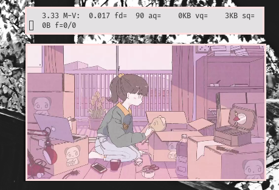

### details ###
	   _______      void     (sys)
	_ \\______ -	runit    (init)
	\\  ___  \\ |	ash      (shell)
	 | /   \ |      vim      (text editor)
	 | \___/ | |	lemonbar (statusbar)
	 \\______ \\_|	sxhkd    (key binder stuff)
	-_______\\	shod     (window manager)
       			mpv      (music/video player)
